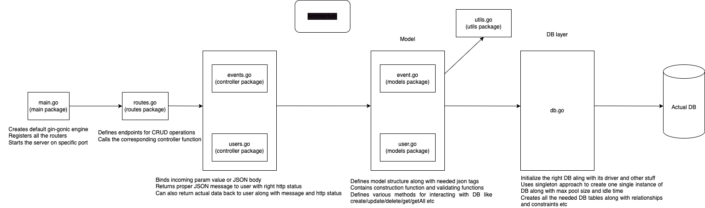
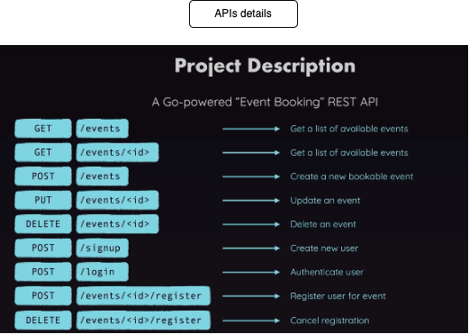
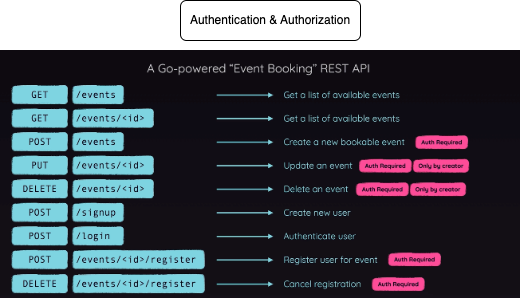

# my-first-go
(With gin-gonic framework by using routes, middlewares, controller, model, utiles, hashing logic for password, JWT token generator and verifier(golang-jwt), db connector and g0-sqlite3 DB)

- User has to signup first by provding their email and password. We will hash the password and save it in DB.
- Next user has to login with their email and password(credentials). We will compare the password with the one which is stored in DB. If user credentials are verified, then we generate a JWT token by adding user email and ID details(by using a secure ID) in it and send it back to user in a response.
- Few of the APIs are not protected which means user can call it without loging in or without authetication. For example GetEvents and GetSinagleEvent APIs
- But other APIs are protected. We have added a gin middleware, which basically expets a token in the request header and then it will try to verify the token(by using the same secure ID). Once the token is verified we will extract the userId from the JWT token claims and set it in the gin context. Then only middleware will forward the request to next handlers. Else, it will send back error response by saying user is not authenticated.
- The APIs like CreateEvent, UpdateEvent, DeleteEvent, RegisterEvent and CancelEvent are all needs authentication. We use group concept of gin-gonic router where we group all of these protected APIs which needs to go through a middleware.
- Finally we also have authorization in place so that we will allow only the creator of an event to update ot delete it by comparing the userId from context against the userId of an event which is stored in the DB

